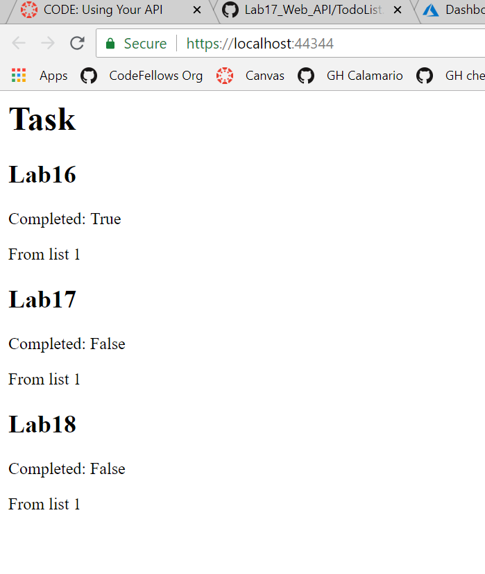

# Lab18_consume_api
A MVC application that consumes the previously made API

## About
An application that consumes our To-Do API made in the previous lab
As of current, it only retrieves the to do items.

The api is gives data back as JSON file and I used NewtonSoft to deserialized
the JSON to C# objects. 

## Visual

## Other 
Used NewtonSoft
Visual Studio